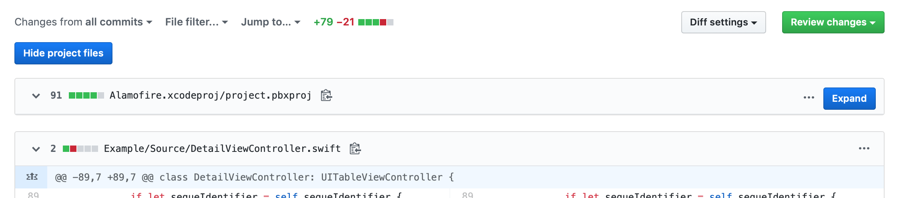

# PowdeR

A Chrome and Safari extension to collapse and hide a configurable set of files from diffs in GitHub PRs.




# Configurationion


The `configuration.json` file allows to customize which files should be made collapsable by the extensions when building them.

The file has 3 keys.

- `domains`: an array that allows to /specify on which domains the extension should be enabled. Besides _github.com_ you could for example add a GitHub Enterprise domain _github.mydomain.io_.
- `powders`: a hash that specify which files should be collapsable. The key of the hash is the text that will appear on the top hide buttons (i.e. "Hide/Show project files"), the value is an array of regular expressions that will be matched against the path of the diffed files to determine which should be collapsable.
- `apple_dev_team`: only needed when building the Safari Extension. This is the 10 digit developer team ID.

An example of configuration file is the following:

```json
{
  "domains": ["github.com"],
  "powders": {
    "xib files": [".xib", ".nib"],
    "project files": [".pbxproj"],
    "asset files": [".xcassets/"],
  }
}
```

# Building

```
$ ./build (all | chrome | safari)
```

You can specify to build both the Chrome and Safari extensions by passing `all`, or selectively build only one of them by either passing `chrome` or `safari`.

## Safari Extension prerequisites

You will need a macOS production Developer ID Application certificate to properly build the extensions. Refer to the [official documentation](https://developer.apple.com/developer-id/) to get you started generating the certificate. Before building make sure to update the configuration file with your 10 digit developer team id.

# Installation

## Chrome

The build script will generate a ChromeExtension.zip file. Unzip it, open [chrome://extensions](chrome://extensions), enable _Developer mode_ and click on _Load unpacked_. Point to the unzipped folder.

## Safari

The build script will generate a _GitHub PowdeR.app_ that you should move to /Applications and open. A sheet will appear with a button that opens the Safari extension preference tab. 

**If the plugin doesn't appear in the list try closing/reopening Safari.**


# Contributions

Contributions are welcome! If you have a bug to report, feel free to help out by opening a new issue or sending a pull request.


# Authors

[Tomas Camin](https://github.com/tcamin) ([@tomascamin](https://twitter.com/tomascamin))


# License

GitHub PowdeR is available under the Apache License, Version 2.0. See the LICENSE file for more info.